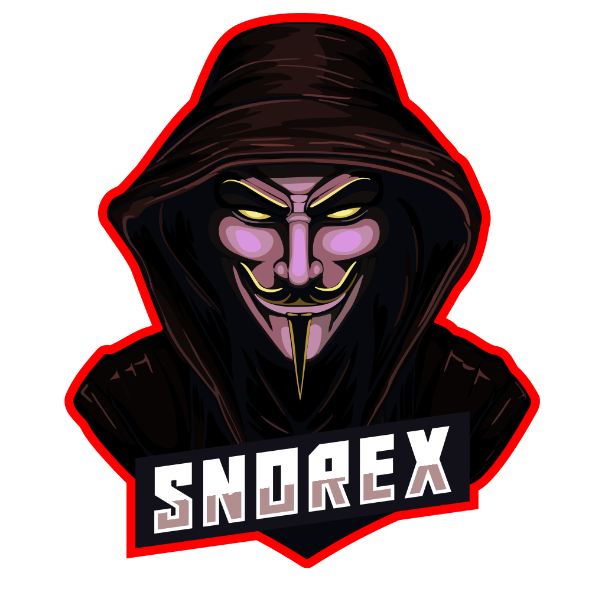
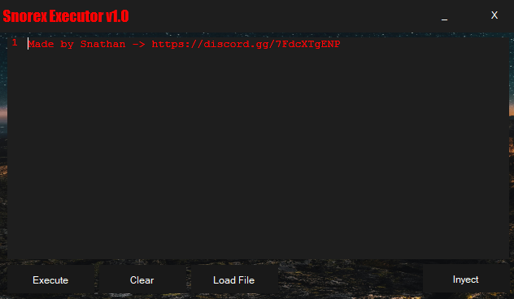

<!-- Improved compatibility of back to top link: See: https://github.com/othneildrew/Best-README-Template/pull/73 -->
<a id="readme-top"></a>
<!--
*** Thanks for checking out the Best-README-Template. If you have a suggestion
*** that would make this better, please fork the repo and create a pull request
*** or simply open an issue with the tag "enhancement".
*** Don't forget to give the project a star!
*** Thanks again! Now go create something AMAZING! :D
-->


<!-- PROJECT SHIELDS -->
<!--
*** I'm using markdown "reference style" links for readability.
*** Reference links are enclosed in brackets [ ] instead of parentheses ( ).
*** See the bottom of this document for the declaration of the reference variables
*** for contributors-url, forks-url, etc. This is an optional, concise syntax you may use.
*** https://www.markdownguide.org/basic-syntax/#reference-style-links
-->
[![Contributors][contributors-shield]][contributors-url]
[![Forks][forks-shield]][forks-url]
[![Stargazers][stars-shield]][stars-url]
[![Issues][issues-shield]][issues-url]
[![MIT License][license-shield]][license-url]


<!-- PROJECT LOGO -->
<br />
<div align="center">
  <a href="https://github.com/Snorex-Executor/Snorex">
    
  </a>
  

<h3 align="center">Snorex Executor</h3>

  <p align="center">
The Snorex Executor project reflects my commitment to harnessing my programming skills in practical and innovative ways. I am dedicated to refining and further expanding Snorex Executor. User feedback and ongoing development will play crucial roles in shaping its future versions, with the ultimate goal of providing a valuable tool for injecting Lua code into Roblox.
    <br />
    <a href="https://github.com/Snorex-Executor"><strong>Explore the docs »</strong></a>
    <br />
    <br />
    <a href="https://github.com/Snorex-Executor">View Demo</a>
    ·
    <a href="https://github.com/Snorex-Executor/Snorex/issues/new">Report Bug</a>
    ·
    <a href="https://github.com/Snorex-Executor/Snorex/pulls">Request Feature</a>
  </p>
</div>


<!-- TABLE OF CONTENTS -->
<details>
  <summary>Table of Contents</summary>
  <ol>
    <li>
      <a href="#about-the-project">About The Project</a>
      <ul>
        <li><a href="#built-with">Built With</a></li>
      </ul>
    </li>
    <li>
      <a href="#getting-started">Getting Started</a>
      <ul>
        <li><a href="#prerequisites">Prerequisites</a></li>
        <li><a href="#installation">Installation</a></li>
      </ul>
    </li>
    <li><a href="#usage">Usage</a></li>
    <li><a href="#roadmap">Roadmap</a></li>
    <li><a href="#contributing">Contributing</a></li>
    <li><a href="#license">License</a></li>
    <li><a href="#contact">Contact</a></li>
    <li><a href="#acknowledgments">Acknowledgments</a></li>
  </ol>
</details>


<!-- ABOUT THE PROJECT -->
## About The Project



 
<p align="right">(<a href="#readme-top">back to top</a>)</p>

### Install Prerequisites
*batch
´´´
pip install figlet 
´´´


### Installation


1. Clone or download the repo
   ```sh
   git clone https://github.com/Snorex-Executor/Snorex.git
   ```


<p align="right">(<a href="#readme-top">back to top</a>)</p>


<!-- USAGE EXAMPLES -->
## Usage

Execute level 7 scripts in roblox

<p align="right">(<a href="#readme-top">back to top</a>)</p>


<!-- ROADMAP -->
## Roadmap

- [ ] Never be patched

<p align="right">(<a href="#readme-top">back to top</a>)</p>


<!-- LICENSE -->
## License

Distributed under the MIT License. See `MIT-LICENSE.txt` for more information.
<p align="right">(<a href="#readme-top">back to top</a>)</p>


<!-- CONTACT -->
## Contact

Your Name - [@SnorexExecutor](https://discord.com/users/1261229364847317044) 

Project Link: https://github.com/Snorex-Executor/Snorex

<p align="right">(<a href="#readme-top">back to top</a>)</p>


<!-- ACKNOWLEDGMENTS -->
## Acknowledgments

* []() Working API
* []() Working Executor
* []() Bypass Byfron

<p align="right">(<a href="#readme-top">back to top</a>)</p>


<!-- MARKDOWN LINKS & IMAGES -->
<!-- https://www.markdownguide.org/basic-syntax/#reference-style-links -->
[contributors-shield]: https://img.shields.io/github/contributors/Snorex-Executor/Snorex.svg?style=for-the-badge
[contributors-url]: https://github.com/Snorex-Executor/Snorex/graphs/contributors
[forks-shield]: https://img.shields.io/github/forks/Snorex-Executor/Snorex.svg?style=for-the-badge
[forks-url]: https://github.com/Snorex-Executor/Snorex/network/members
[stars-shield]: https://img.shields.io/github/stars/Snorex-Executor/Snorex.svg?style=for-the-badge
[stars-url]: https://github.com/Snorex-Executor/Snorex/stargazers
[issues-shield]: https://img.shields.io/github/issues/Snorex-Executor/Snorex.svg?style=for-the-badge
[issues-url]: https://github.com/Snorex-Executor/Snorex/issues
[license-shield]: https://img.shields.io/github/license/Snorex-Executor/Snorex.svg?style=for-the-badge
[license-url]: https://github.com/Snorex-Executor/Snorex/blob/master/MIT-LICENSE.txt
[Next.js]: https://img.shields.io/badge/next.js-000000?style=for-the-badge&logo=nextdotjs&logoColor=white
[Next-url]: https://nextjs.org/
[React.js]: https://img.shields.io/badge/React-20232A?style=for-the-badge&logo=react&logoColor=61DAFB
[React-url]: https://reactjs.org/
[Vue.js]: https://img.shields.io/badge/Vue.js-35495E?style=for-the-badge&logo=vuedotjs&logoColor=4FC08D
[Vue-url]: https://vuejs.org/
[Angular.io]: https://img.shields.io/badge/Angular-DD0031?style=for-the-badge&logo=angular&logoColor=white
[Angular-url]: https://angular.io/
[Svelte.dev]: https://img.shields.io/badge/Svelte-4A4A55?style=for-the-badge&logo=svelte&logoColor=FF3E00
[Svelte-url]: https://svelte.dev/
[Laravel.com]: https://img.shields.io/badge/Laravel-FF2D20?style=for-the-badge&logo=laravel&logoColor=white
[Laravel-url]: https://laravel.com
[Bootstrap.com]: https://img.shields.io/badge/Bootstrap-563D7C?style=for-the-badge&logo=bootstrap&logoColor=white
[Bootstrap-url]: https://getbootstrap.com
[JQuery.com]: https://img.shields.io/badge/jQuery-0769AD?style=for-the-badge&logo=jquery&logoColor=white
[JQuery-url]: https://jquery.com 
